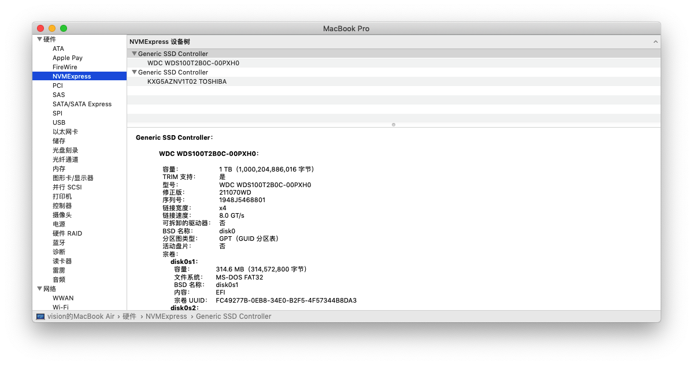
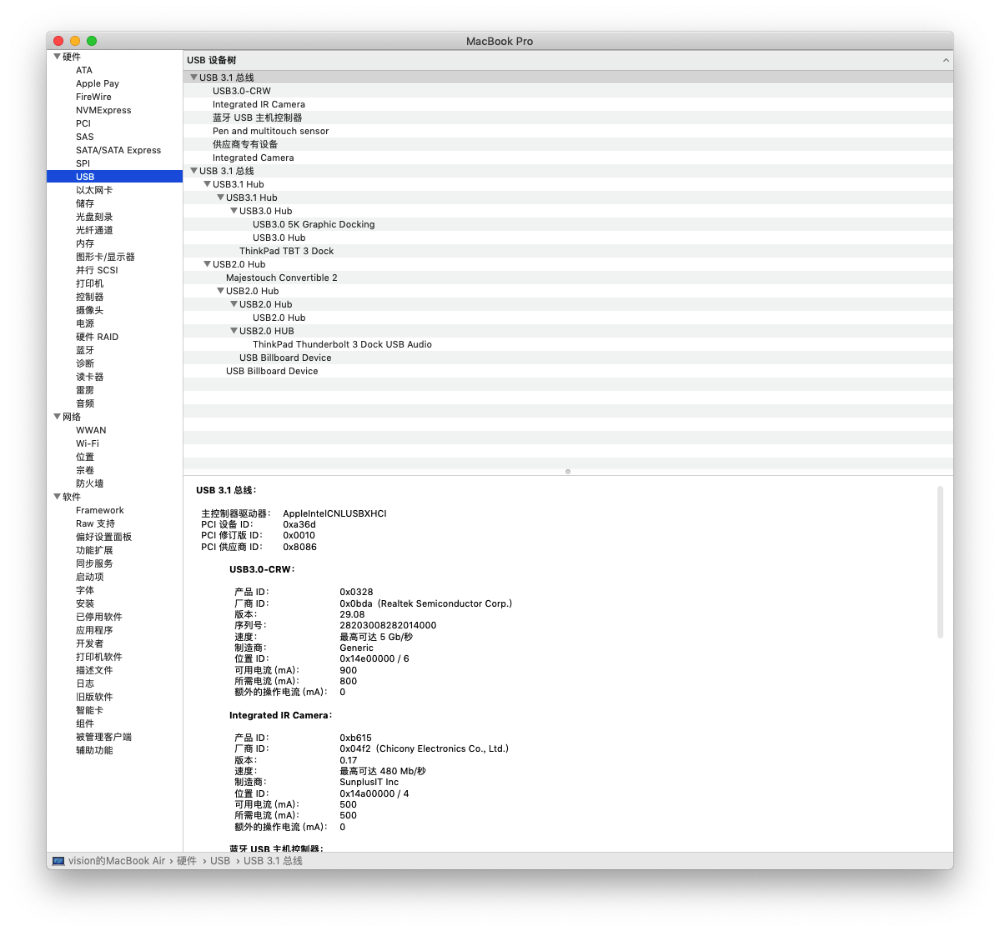
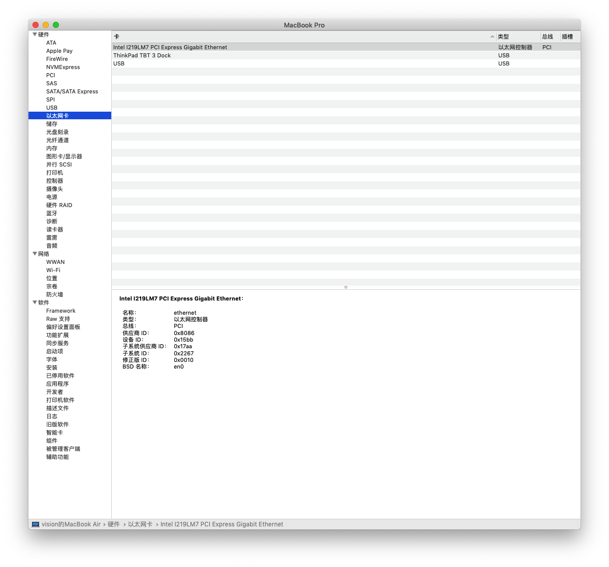
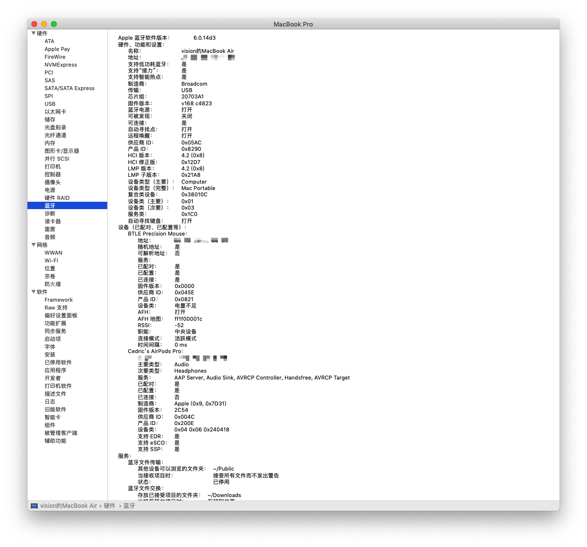
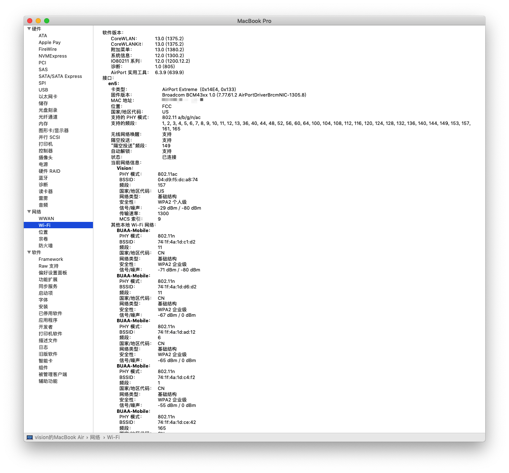

# ThinkPad-P1-Hackintosh

> 根据 https://github.com/Errrneist/Hackintosh-Thinkpad-X1-Extreme 制作
>
> 感谢https://github.com/p455555555/Thinkpad-P1-EFI

近两日折腾的结果，分享如下：

配置：

CPU：Intel Xeon E-2176M

显卡： Intel UHD Graphics P630， Nvidia P2000 max-q（无法驱动）

硬盘： WesternDigital SN550 1T + Toshiba XG5 1T

声卡： ALC285

显示屏： 4K 3840*2160

内存： Samsung ECC 16GX2

Wi-Fi/蓝牙：苹果BCM943602CS+转接卡

> 美版ThinkPad P1， BIOS 1.23版本没有无线网卡白名单
>
> （如果你们的有白名单还是老老实实刷一下吧

网卡+转接卡链接：

[https://github.com/zysuper/Thinkpad-X1-extreme-EFI/blob/master/doc/Wi-Fi%20bluethooth.md](https://github.com/zysuper/Thinkpad-X1-extreme-EFI/blob/master/doc/Wi-Fi bluethooth.md)

可用组件：

1. 触摸屏+4K+HiDPI+亮度调节
2. 多指触控
3. 读卡器
4. 雷电3接口热插拔（通过USB总线）
5. 蓝牙
6. 无线网络

不可用组件：

1. 指纹
2. 雷电3热插拔

外接设备

ThinkPad Workstation ThunderBolt 3 Dock

WAVLINK **WL-UG69DK1** USB扩展坞（外接usb显卡，可以实现双4k单5k） 

> 链接：https://item.jd.com/8734480.html

系统信息

